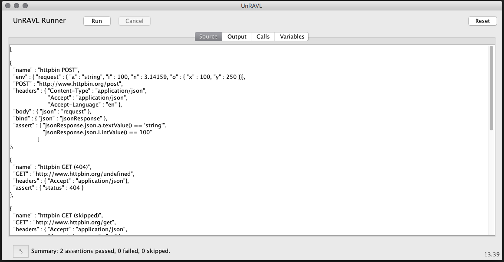
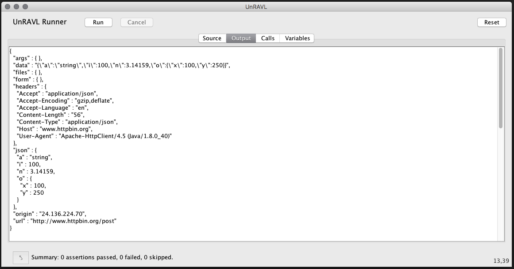
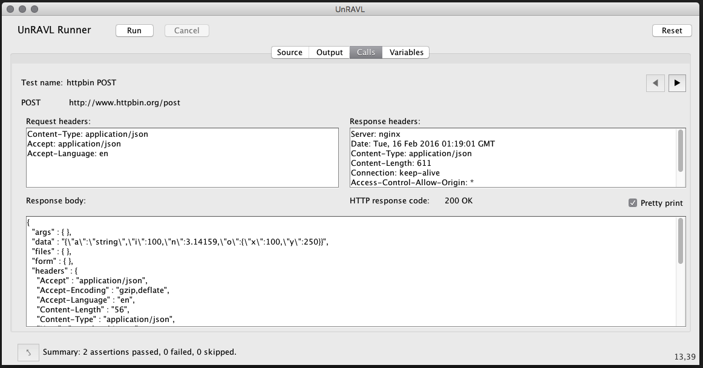
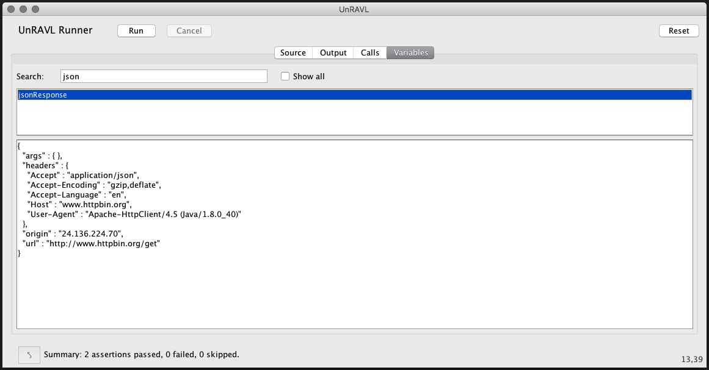

# Interactive mode

UnRAVL also has a basic user interface which allows you
to interactively submit UnRAVL scripts and view the results.

To start UnRAVL in interactive mode, run the unravl
start script without any UnRAVL script files on the command line:

Linux and Mac OS X:
```
unravl.sh
```
Windows:
```
unravl.bat
```

There are four tabs in the interface: [Source](#source),
[Output](#output), [Calls](#calls), and [Variables](#variables).

## Source

In the **Source** tab,
you can enter an UnRAVL script using JSON notation.
The interface does basic JSON syntax checking as you type,
highlighting errors.



If the JSON is valid, the **Run** button will be enabled.
Click the **Run** button to
submit the UnRAVL script from the source pane.
The interface will automatically switch to the Output tab where you
can see the results of running the script.

Use the `{ }` button to pretty-print the source JSON.
You can increase/decrease the font size in the source text area
by using the mouse wheel while holding the Control key.
(On Apple OS X with a trackpad, use Control and two-finger drag
gesture.)

UnRAVL automatically saves the source and restores
it the next time you start the application.
Future enhancements will add the normal **File -> Open**,
**File -> Save** and **File -> Save** as menu operations.

You may drag a file from your file explorer into
the text area to use that source. However, the UI
does not (yet) warn you if you have unsaved text;
thhis action will unconditionaly replace the source with
the text from the file you dropped.

Note that the UnRAVL script can also reference
script files on the file system. For example,
if the source is just

```JSON
"@src/test/scripts/test.unravl"
```

then the interactive mode will execute the UnRAVL
test in the file `src/test/scripts/test.unravl`,
relative to the directory where you ran UnRAVL.
This is handy of you prefer an JSON external
editor.

If there are JSON syntax errors in the source,
the interface highlights the first error and the
app displays the error message in the status line
below the text area.
Click the arrow button at the bottom
left to move the cursor to the first syntax error.
(Caveat: Sometimes the cause of the error is the previous line.)

## Output

The **Output** tab shows the standard output and standard error
captured while running the script.



For example, the output of any [Bind](../Bind.md) elements
will appear hear. If the script contains

```JSON
  "bind" : { "json" : "@-" }
```
the output from the REST API call will be printed to
the Output tab.

## Calls

The **Calls** tab shows the history of
each REST HTTP API call (GET, PUT, POST, PATCH, DELETE).
Use the buttons at the top right to move back and forth
in the history. For each test, the calls tab shows
* the test name
* the HTTP method
* the URL
* the request headers
* the response headers,
* HTTP status code
* the response body
* a summary with the number of passed, failed, and skipped
  assertions. The summary line also indicates if the particular
  test was cancelled or skipped. A test can be skipped if
  there were previous assertion errors or the test `"if" :
  condition` guard condition was `false`.



The **Reset** button clears the API call history
as well as removing variables defined by the
tests.

## Variables

You may also select the **Variables** tab to view UnRAVL
variables. At the top is a list of the variables
bound in the current UnRAVL runtime.
Click on a variable name to see its
value in the bottom of the **Variables** tab.



UnRAVL interface will pretty-print JSON objects
and arrays for variables that have JSON values
or String values that parse as JSON.
You may only view one variable at a time.

If you uncheck the **Show all** checkbox, the variables
list will list only variables that were bound or
modified when the most recent UnRAVL scripts executed.

You can also type in a **Search:** string and only variables
whose names contain the search text will be shown.
This search is *case sensitive*.
Clear the search box to remove the filtering.

